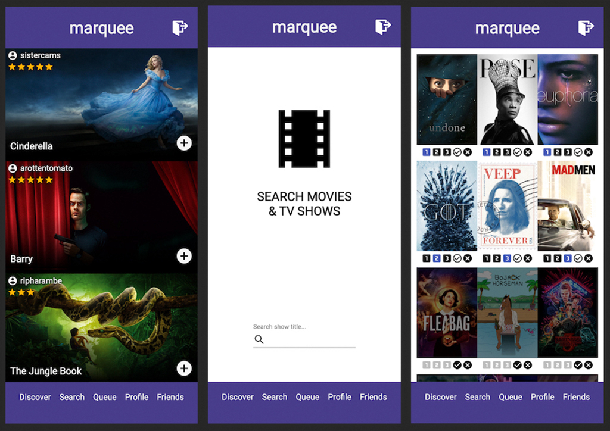

# Marquee (Mobile)

**Currently Formatted for:** iPhone X

_Project Duration: 2 Week Sprint_

Made for avid movie/television watchers, Marquee makes recommendations based on what friends on the app are watching and allows registered members to keep track of both everything they've watched and everything they plan to watch. Members can create a personal watch list where they can organize their queued-up shows by priority, as well as add already watched shows to a public profile that friends can view.

## Application Screen Shots:



## Prerequisites

Before getting started, make sure you have the following software installed on your computer:

-    [Node.js](https://nodejs.org/en/)
-    [PostrgeSQL](https://www.postgresql.org/)
-    [Nodemon](https://nodemon.io/)

Marquee requires an API key from [The Movie DB](https://www.themoviedb.org/).

_For more instruction, please see below._

## Create database and table

Create a new database called `marquee_app` and create the following tables:

```SQL
CREATE TABLE "user" (
    "id" SERIAL PRIMARY KEY,
    "username" VARCHAR (50) UNIQUE NOT NULL,
    "password" VARCHAR (1000) NOT NULL
);

CREATE TABLE "watch" (
    "id" SERIAL PRIMARY KEY,
    "title" VARCHAR(50),
    "poster" VARCHAR(150),
    "backdrop" VARCHAR(150),
    "priority" VARCHAR(10),
"rating" INT DEFAULT 0,
    "completed" BOOLEAN DEFAULT FALSE,
    "date_updated" TIMESTAMP,
    "user_id" INT REFERENCES "user"
);

CREATE TABLE "friend" (
    "id" SERIAL PRIMARY KEY,
    "user_id" INT REFERENCES "user",
    "friend_id" INT REFERENCES "user"
);
```

## The Movie Database API

An API key is required for use of this application from [The Movie Database](https://www.themoviedb.org/).

-    [Sign up](https://www.themoviedb.org/account/signup) for an account.

-    Follow these [instructions](https://developers.themoviedb.org/3/getting-started/introduction) to register this application and request an API key.

-    Insert API key into .env file as described below.

## Development Setup Instructions

-    Run `npm install`
-    Create a `.env` file at the root of the project and paste this line into the file:

     ```
     SERVER_SESSION_SECRET = superDuperSecret
     API-KEY = *YOUR-TMDB-API-KEY-GOES-HERE*
     ```

     While you're in your new `.env` file, take the time to replace `superDuperSecret` with some long random string like `25POUbVtx6RKVNWszd9ERB9Bb6` to keep your application secure. Here's a site that can help you: [https://passwordsgenerator.net/](https://passwordsgenerator.net/). If you don't do this step, create a secret with less than eight characters, or leave it as `superDuperSecret`, you will get a warning.

-    Start Postgres if not running already by using `brew services start postgresql`
-    Run `npm run server`
-    Run `npm run client`
-    Navigate to `localhost:3000`

## How To Use Marquee (An Overview)

-    Login/Register for account in order to sign into Marquee.

-    View recommendations from added friends on _Discover_.

-    Search for shows you plan to watch in the future in _Search_.

-    Organize added shows in your custom watchlist in your _Queue_.

-    Arrange shows by priority (1/2/3) and check off shows you've completed.

-    Rate shows you've finished watching in your public _Profile_ for friends to see.

-    View your list of friends in and look up new friends to add in _Friends_.

## Future Features

- [x] Deploy application to Heroku
- [ ] Format for non-mobile browser viewing
- [ ] Introduction "Home" page before login/registration with description of app
- [ ] Extend Discover view to feature an up-to-date feed of recently watched content from friends 
- [ ] Customization for user profiles (select and display favorite/current show titles, custom banner images)
- [ ] Option to order shows on Queue and Profile pages by either date added or priority/rating
- [ ] Friend request system with accept/decline abilities vs following/adding

## Built With

-    [React](https://reactjs.org/) - the web framework used
-    [Redux](https://maven.apache.org/) - manages application state
-    [Express](https://expressjs.com/) - web framework used with Node.js
-    [Passport](http://www.passportjs.org/) - authentication middleware for Node.js
-    [PostgreSQL](https://www.postgresql.org/) - database management system
-    [Material-UI](https://material-ui.com/) - a UI framework used with React
-    [SweetAlert2](https://sweetalert2.github.io/) - replacement for JS popups
-    [TMDB API](https://developers.themoviedb.org/3/getting-started/introduction) - the API used to access all data/images

## Acknowledgements

-    A huge thanks to [Prime Digital Academy](https://github.com/PrimeAcademy) in Minneapolis, and to my instructors Dane Smith and Kris Szafranski for providing the tools and instruction to help me develop the first version of this mobile application.
-    Special credit to [The Movie Database API](https://www.themoviedb.org/) for providing access to an enormous database of movie/television show titles, information, and high-resolution images of a variety of sizes and styles.
