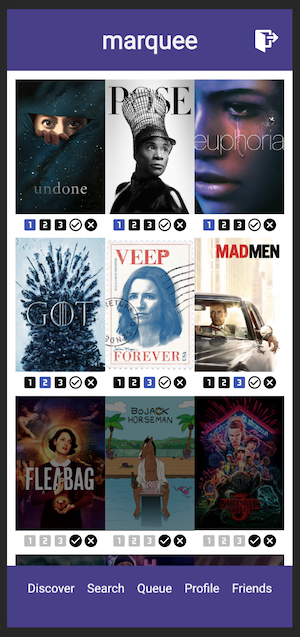

# Marquee (Mobile)

Made for avid movie/television watchers, Marquee makes recommendations based on what friends on the app are watching and allows registered members to keep track of both everything they've watched and everything they plan to watch. Members can create a personal watch list where they can organize their queued-up shows by priority, as well as add already watched shows to a public profile that friends can view.

## Built With

- [React](https://reactjs.org/) - the web framework used
- [Redux](https://maven.apache.org/) - manages application state
- [Express](https://expressjs.com/) - web framework used with Node.js
- [Passport](http://www.passportjs.org/) - authentication middleware for Node.js
- [PostgreSQL](https://www.postgresql.org/) - database management system
- [Material-UI](https://material-ui.com/) - a UI framework used with React
- [SweetAlert2](https://sweetalert2.github.io/) - replacement for JS popups

## Prerequisites

Before getting started, make sure you have the following software installed on your computer:

- [Node.js](https://nodejs.org/en/)
- [PostrgeSQL](https://www.postgresql.org/)
- [Nodemon](https://nodemon.io/)

## Create database and table

Create a new database called `marquee_app` and create the following tables:

```SQL
CREATE TABLE "user" (
    "id" SERIAL PRIMARY KEY,
    "username" VARCHAR (50) UNIQUE NOT NULL,
    "password" VARCHAR (1000) NOT NULL
);

CREATE TABLE "watch" (
    "id" SERIAL PRIMARY KEY,
    "title" VARCHAR(50),
    "poster" VARCHAR(150),
    "backdrop" VARCHAR(150),
    "priority" VARCHAR(10),
	"rating" INT DEFAULT 0,
    "completed" BOOLEAN DEFAULT FALSE,
    "date_updated" TIMESTAMP,
    "user_id" INT REFERENCES "user"
);

CREATE TABLE "friend" (
    "id" SERIAL PRIMARY KEY,
    "user_id" INT REFERENCES "user",
    "friend_id" INT REFERENCES "user"
);
```

## Development Setup Instructions

- Run `npm install`
- Create a `.env` file at the root of the project and paste this line into the file:
  ```
  SERVER_SESSION_SECRET = superDuperSecret
  API-KEY = **PLEASE REQUEST API_KEY FROM DEVELOPER**
  ```
  While you're in your new `.env` file, take the time to replace `superDuperSecret` with some long random string like `25POUbVtx6RKVNWszd9ERB9Bb6` to keep your application secure. Here's a site that can help you: [https://passwordsgenerator.net/](https://passwordsgenerator.net/). If you don't do this step, create a secret with less than eight characters, or leave it as `superDuperSecret`, you will get a warning.
- Start Postgres if not running already by using `brew services start postgresql`
- Run `npm run server`
- Run `npm run client`
- Navigate to `localhost:3000`

## Application Screen Shots




## Production Build

Before pushing to Heroku, run `npm run build` in terminal. This will create a build folder that contains the code Heroku will be pointed at. You can test this build by typing `npm start`. Keep in mind that `npm start` will let you preview the production build but will **not** auto update.

- Start postgres if not running already by using `brew services start postgresql`
- Run `npm start`
- Navigate to `localhost:5000`

## Deployment

1. Create a new Heroku project
1. Link the Heroku project to the project GitHub Repo
1. Create an Heroku Postgres database
1. Connect to the Heroku Postgres database from Postico
1. Create the necessary tables
1. Add an environment variable for `SERVER_SESSION_SECRET` with a nice random string for security
1. In the deploy section, select manual deploy

## Acknowledgements

[Delaney McKee Sharratt](https://github.com/laneymckee)

## Acknowledgements

- A huge thanks to Prime Digital Academy (Minneapolis), and to my instructors Dane and Kris for providing the tools and instruction to help me develop the first version of this mobile application over the course of two weeks.
